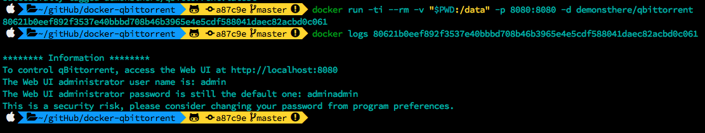
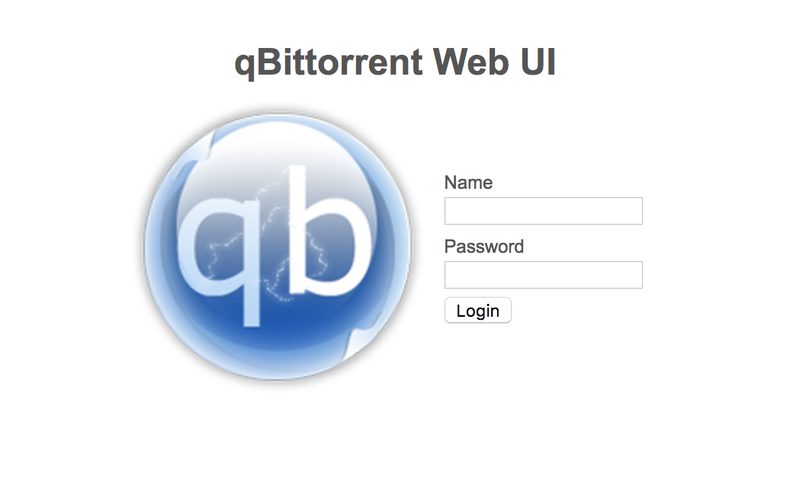
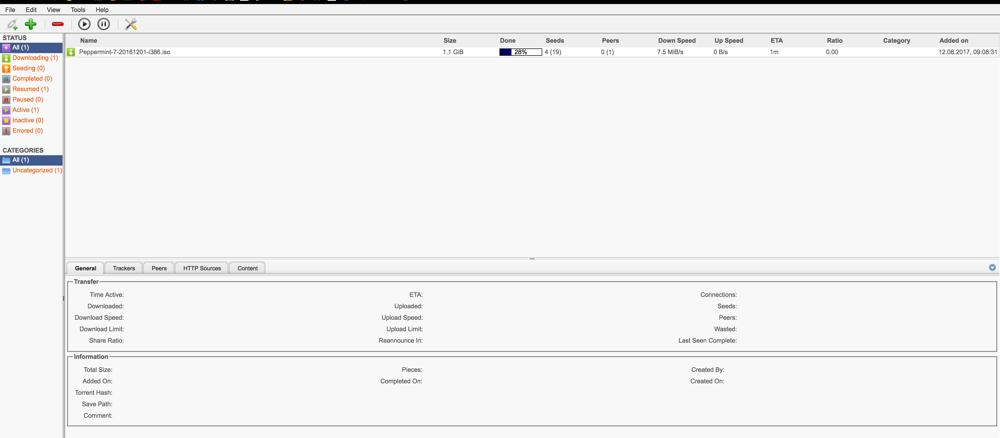

# docker-qbittorrent
This repository holds the Dockerfile to create an image with the qbittorrent web-based client.

## How to use
To start the container either build it from source (using `docker build .`) or use the version from dockerhub: `docker pull demonsthere/qbittorrent`

### Docker run

### WebUI
To access the WebUI simply navigate your browser to your localhost on the port specified in the command (here it is localhost:8080)

The default credentials are **admin:adminadmin**

Now, to start downloading just add a local .torrrent file, like the Peppermint Linux from the files directory

